# Wazuh SOC Home Lab Documentation

This document is the complete write-up of my Wazuh SOC home lab.

## Lab Overview

### Objective
Build a practical SOC lab with endpoint visibility, alerting, and response validation using Wazuh.

### Environment
- **Hypervisor**: Oracle VirtualBox
- **Manager VM (Ubuntu)**: Wazuh Indexer + Wazuh Manager + Wazuh Dashboard
- **Agent VM (Ubuntu)**: Wazuh Agent

### Architecture Summary
- Agent enrollment channel: `1515/tcp`
- Agent event forwarding channel: `1514/tcp`
- Dashboard access: `443` (or `5601` depending on deployment)

Screenshot description: High-level lab architecture used for all POCs.
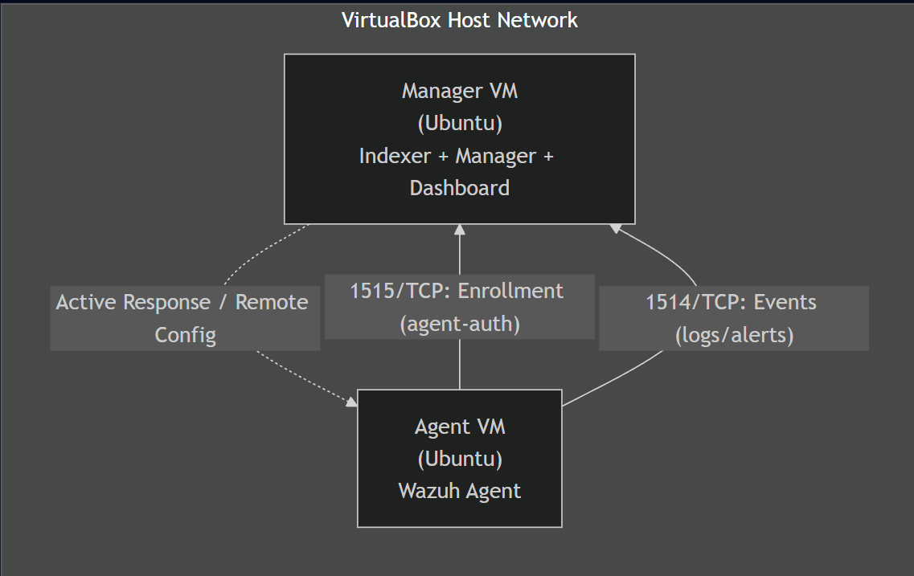

---

## Index (POCs Completed)

- [Setup & Installation (Manager + Agent)](#setup--installation-manager-vm--agent-vm)
- [POC 1: File Integrity Monitoring (FIM)](#poc-1-file-integrity-monitoring-fim)
- [POC 2: Detecting an SSH Brute-Force Attack](#poc-2-detecting-an-ssh-brute-force-attack-wazuh)
- [POC 3: Rootcheck Trojan Detection](#poc-3-rootcheck-trojan-detection)
- [POC 4: IP Reputation Blocking + Active Response](#poc-4-ip-reputation-blocking--active-response-firewall-drop)
- [Consolidated Troubleshooting](#consolidated-troubleshooting-quick-reference)

---

## Setup & Installation (Manager VM + Agent VM)

### Objective
Deploy Wazuh manager stack, enroll agent, and verify agent events in dashboard.

### Prerequisites
- Two Ubuntu VMs on a reachable network (host-only or bridged)
- Manager and Agent can reach each other over required ports

### Configuration Steps

#### 1) Start and verify manager services (Manager VM)
```bash
sudo systemctl start wazuh-indexer wazuh-manager wazuh-dashboard
sudo systemctl enable wazuh-indexer wazuh-manager wazuh-dashboard
sudo systemctl status wazuh-indexer wazuh-manager wazuh-dashboard --no-pager
sudo ss -lntup | egrep '1514|1515|443|5601|9200'
```

**Expected Output**
- All services show `active (running)`
- Manager listens on enrollment and event ports

#### 2) Verify manager port reachability from agent (Agent VM)
```bash
nc -vz 192.168.56.105 1514
nc -vz 192.168.56.105 1515
```

**Expected Output**
- Successful TCP connection checks

#### 3) Enroll and start agent (Agent VM)
```bash
sudo systemctl stop wazuh-agent
sudo rm -f /var/ossec/etc/client.keys
sudo /var/ossec/bin/agent-auth -m 192.168.56.105 -p 1515 -A "ubuntu-agent-01"
sudo systemctl start wazuh-agent
sudo systemctl status wazuh-agent --no-pager
sudo tail -n 120 /var/ossec/logs/ossec.log
```

**Expected Output**
- Agent starts successfully
- Logs show enrollment/connection behavior

### Wazuh Alert Analysis
- Open **Threat Hunting** in dashboard
- Filter by agent name to confirm incoming events

```text
agent.name: "ubuntu-agent-01"
```

### Troubleshooting Notes (Real issues faced)

#### Issue: Agent running but not visible in dashboard
- **Cause**: Wrong manager IP used (NAT/non-reachable path)
- **Fix**: Re-enroll using reachable host-only/bridged manager IP

```bash
nc -vz 192.168.56.105 1514
nc -vz 192.168.56.105 1515
sudo tail -n 200 /var/ossec/logs/ossec.log
```

#### Issue: `invalid agent name`
- **Cause**: stale keys / duplicate agent identity
- **Fix**: clean key and enroll with unique name

```bash
sudo systemctl stop wazuh-agent
sudo rm -f /var/ossec/etc/client.keys
sudo /var/ossec/bin/agent-auth -m 192.168.56.105 -p 1515 -A "ubuntu-agent-01"
sudo systemctl start wazuh-agent
```

Screenshot description: Wazuh dashboard overview after manager services are healthy.
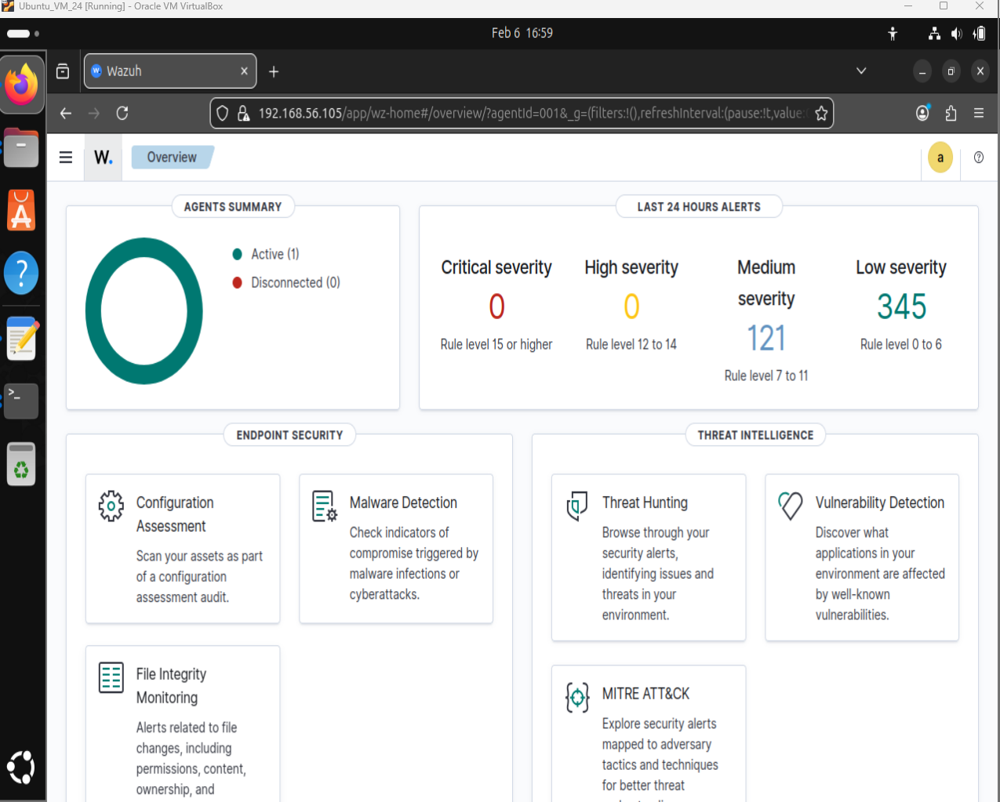

Screenshot description: Agent enrollment and service output from terminal.
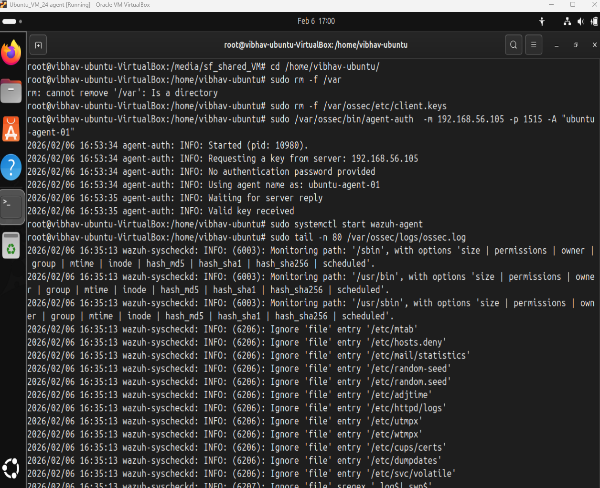

Screenshot description: Threat hunting events confirming agent telemetry ingestion.
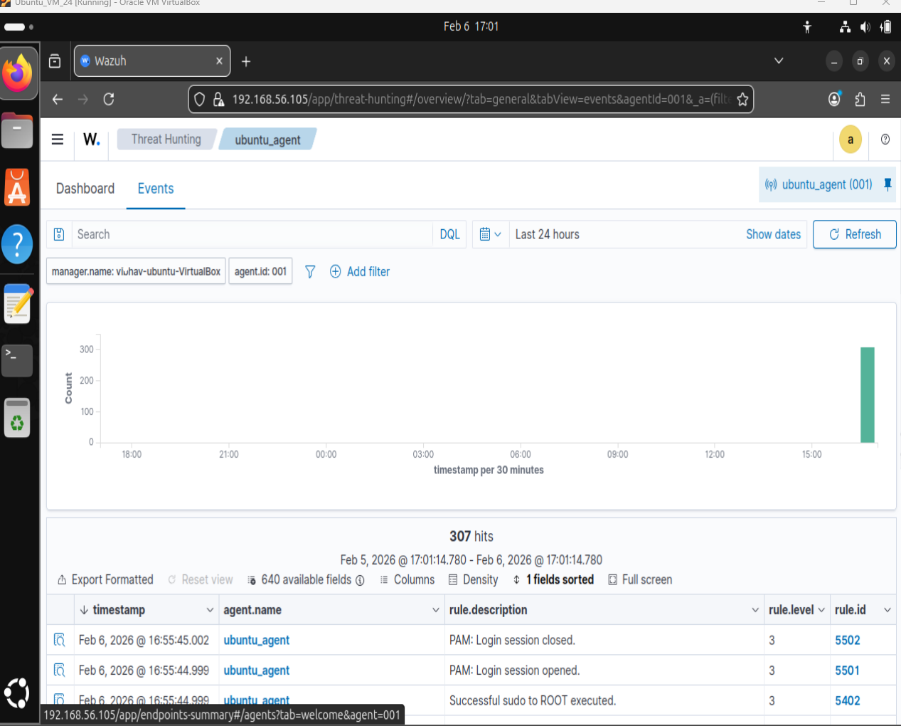

Screenshot description: Agent-side `ossec.conf` validation during troubleshooting.
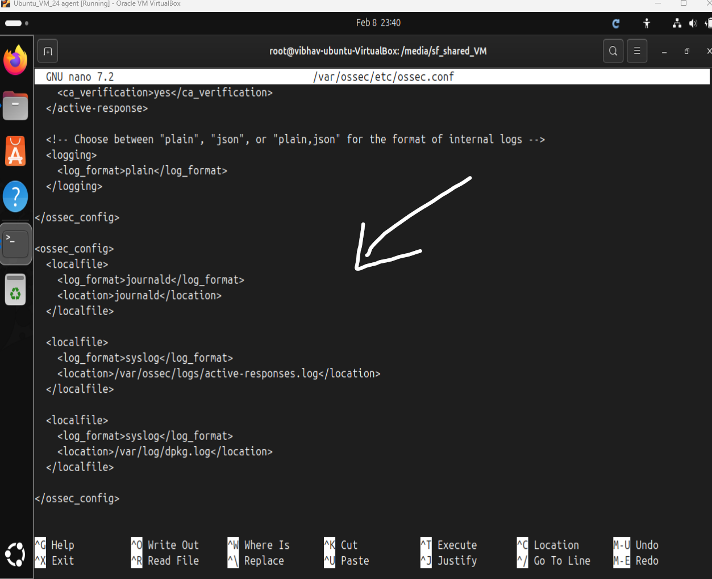

---

## POC 1: File Integrity Monitoring (FIM)

### Objective
Validate FIM detection for file create/modify/delete events from a monitored directory.

### Environment / Prerequisites
- Agent connected to manager
- Access to `/var/ossec/etc/ossec.conf` on Agent VM

### Configuration Steps

#### 1) Create controlled lab directory (Agent VM)
```bash
sudo mkdir -p /home/<USER>/SOC_lab
sudo chown -R <USER>:<USER> /home/<USER>/SOC_lab
```

**Expected Output**
- Directory exists and is writable

#### 2) Update `<syscheck>` config (Agent VM)
```bash
sudo nano /var/ossec/etc/ossec.conf
```

Add inside `<syscheck>`:
```xml
<directories check_all="yes" report_changes="yes" realtime="yes">/home/<USER>/SOC_lab</directories>
```

**Expected Output**
- Valid syscheck line present
- Correct attribute name is `report_changes`

#### 3) Restart agent
```bash
sudo systemctl restart wazuh-agent
sudo tail -n 200 /var/ossec/logs/ossec.log | grep -i syscheck
```

**Expected Output**
- Syscheck/FIM activity appears in logs

### Attack Simulation / Test Steps
```bash
# Create
echo "v1" > /home/<USER>/SOC_lab/test.txt
sleep 5

# Modify
echo "v2" >> /home/<USER>/SOC_lab/test.txt
sleep 5

# Delete
rm -f /home/<USER>/SOC_lab/test.txt
```

**Expected Output**
- All 3 file actions complete successfully

### Wazuh Alert Analysis
Navigate to **File Integrity Monitoring → Events**.

Use filters:
```text
rule.id: is one of 550,553,554
```

Optional:
```text
agent.name: "<YOUR_AGENT_NAME>"
syscheck.path: "/home/<USER>/SOC_lab/test.txt"
```

**Expected Output**
- `554` = added
- `550` = modified
- `553` = deleted

### Troubleshooting Notes
- Path confusion during testing was fixed by using absolute path under `/home/<USER>/...`
- Typo correction: `report_changer` → `report_changes`

### What this proves for a SOC analyst role
- Ability to configure and validate endpoint integrity monitoring
- Ability to map low-level behavior to detection rule IDs

Screenshot description: Syscheck `<directories>` configuration for realtime FIM.


Screenshot description: Create/modify/delete commands run on agent endpoint.
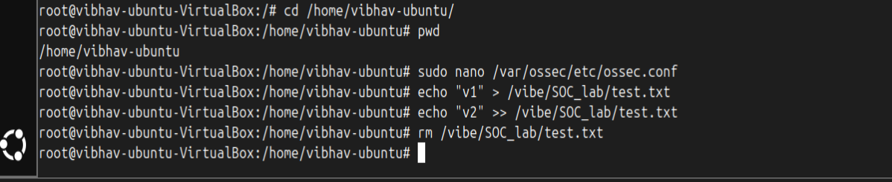

Screenshot description: Wazuh FIM events showing add/modify/delete detections.
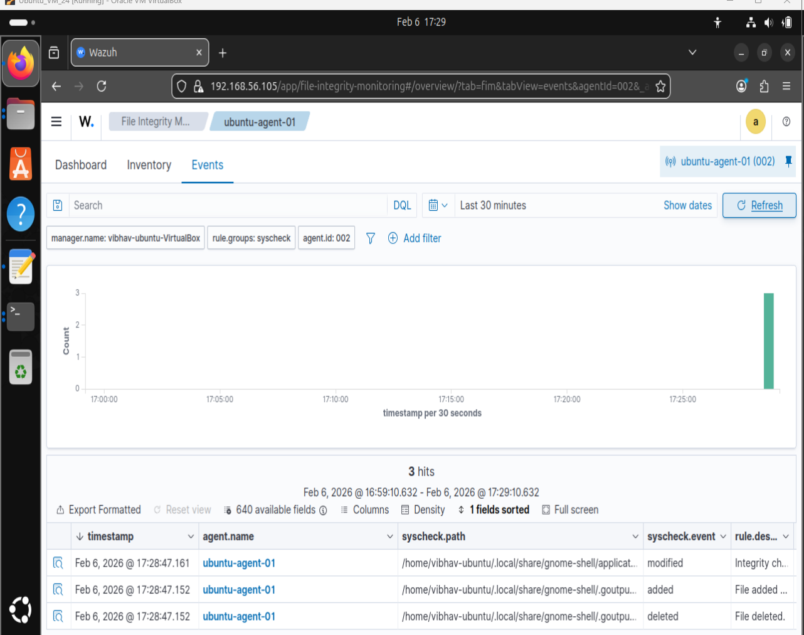

---

## POC 2: Detecting an SSH Brute-Force Attack (Wazuh)

> **Goal:** Simulate repeated SSH login failures against an Ubuntu endpoint and validate that Wazuh detects and correlates this behavior into SOC-meaningful alerts.

### Lab Context

| Component | VM | Role |
|---|---|---|
| Wazuh Manager + Dashboard | **Manager VM** | SIEM/XDR UI + alert processing |
| Wazuh Agent | **Agent VM** | Endpoint generating SSH auth logs |

> In this POC, the **Manager VM** generated test traffic toward the **Agent VM** (authorized lab-only simulation).

### Objective
1. Ensure SSH is running on the Agent VM.
2. Generate multiple failed SSH logins in a short time.
3. Confirm Wazuh ingests and correlates detections.

### Prerequisites
#### On Agent VM (Target)
- Wazuh agent connected and reporting
- SSH server installed and enabled

#### On Manager VM (Traffic Generator)
- A tool/method to generate repeated SSH login attempts inside lab only

### Step 1 — Enable SSH on Agent VM
```bash
sudo apt update
sudo apt install -y openssh-server
sudo systemctl enable --now ssh
sudo systemctl status ssh --no-pager
```

**Expected Output**
- SSH service is `active (running)` and listening on port `22`

Screenshot description: Agent VM SSH service enabled and running.
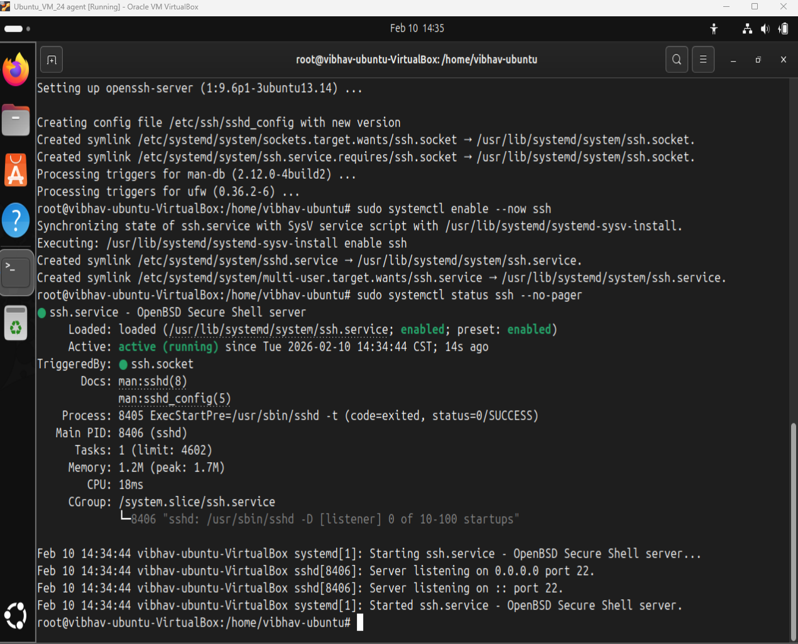

### Step 2 — Install test tool on Manager VM
If package manager is interrupted, fix first:
```bash
sudo dpkg --configure -a
sudo apt -f install -y
sudo apt update
```

Then install tool:
```bash
sudo apt install -y hydra
```

**Expected Output**
- Hydra installs successfully on manager VM

Screenshot description: Hydra installation output on manager VM.
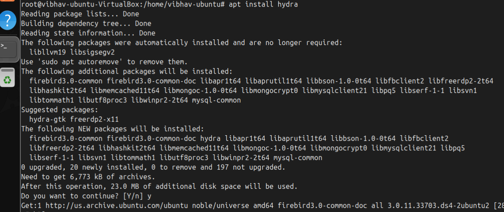

### Step 3 — Prepare simple password list
Create a small wordlist on manager VM (lab-only test data).

**Expected Output**
- Password list file created and ready for simulation

Screenshot description: Password list creation used for brute-force simulation.
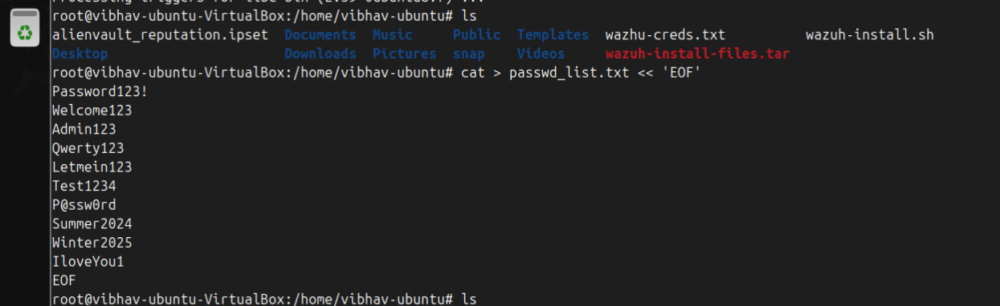

### Step 4 — Simulate brute-force attempts (authorized lab only)
From manager VM, generate repeated SSH login attempts against agent VM using wrong credentials.

**Expected Output**
- Repeated authentication failures
- `/var/log/auth.log` on agent records failed attempts

Screenshot description: Brute-force simulation execution from manager VM.


### Step 5 — Validate telemetry on Agent VM (ground truth)
```bash
sudo tail -n 50 /var/log/auth.log
```

**Expected Output**
- Repeated entries like `Failed password for invalid user ...`
- Entries like `Connection closed by invalid user ...`

Screenshot description: Agent auth.log confirms failed SSH login attempts.
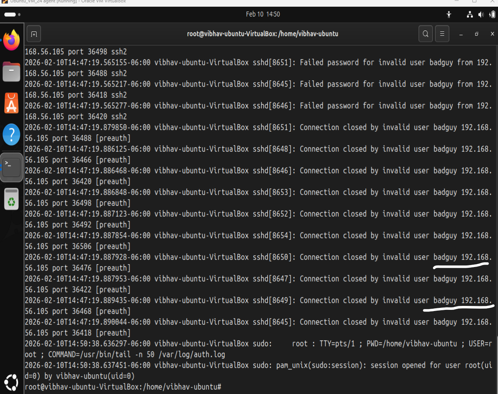

### Step 6 — Wazuh detection evidence (Threat Hunting)
In dashboard: **Threat Hunting → Events**

Suggested filters:
```text
agent.name: "ubuntu-agent-01"
rule.groups: ssh
```

**Observed alerts from this run**

| Rule ID | Level | Meaning |
|---:|---:|---|
| 5710 | 5 | sshd: Attempt to login using a non-existent user |
| 5503 | 5 | PAM: User login failed |
| 5551 | 10 | PAM: Multiple failed logins in a short period |

**Expected Output**
- Individual failed-login alerts + correlated brute-force style alert

Screenshot description: Threat Hunting output with SSH brute-force related rules.
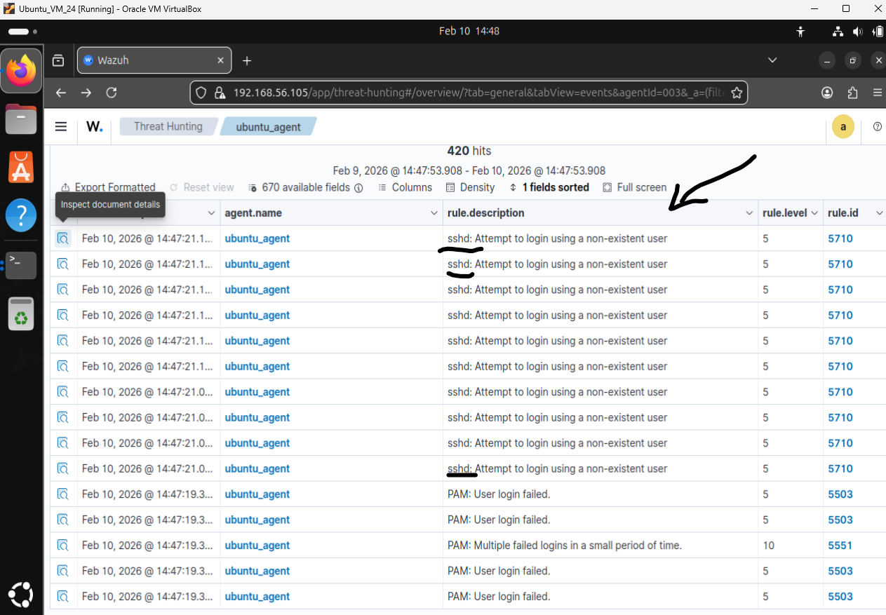

### Step 7 — MITRE ATT&CK mapping
From event details, this activity maps to:
- **T1110.001** (Password Guessing)
- **T1021.004** (Remote Services: SSH)

Tactics observed:
- **Credential Access**
- **Lateral Movement**

**Expected Output**
- MITRE techniques and tactics visible in event details

Screenshot description: MITRE ATT&CK mapping shown in Wazuh event details.
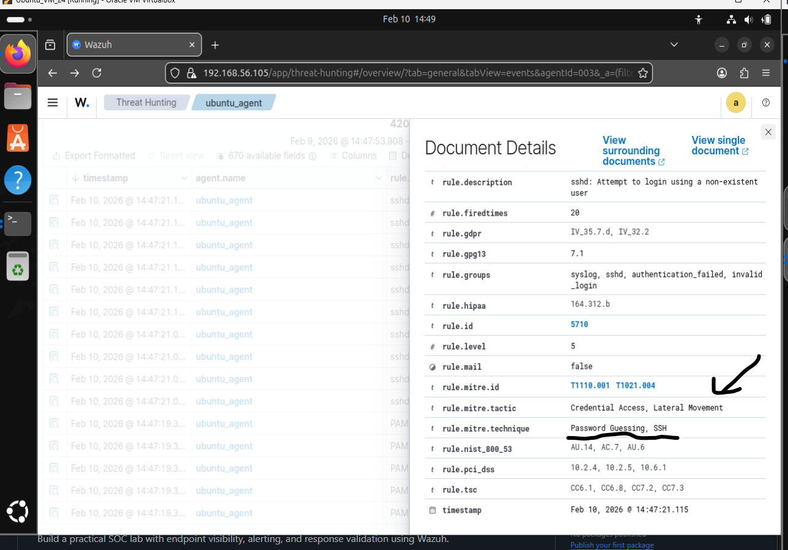

### What this proves for a SOC analyst role
- Log source validation using `/var/log/auth.log`
- Detection validation from behavior to correlated alert
- Triage workflow with filters, rule review, and context linkage
- MITRE interpretation tied to real endpoint telemetry

### Optional hardening notes
- Disable password auth and enforce SSH keys (`PasswordAuthentication no`)
- Restrict users (`AllowUsers <known_users>`)
- Lower `MaxAuthTries`
- Add `fail2ban` or firewall rate limiting
- Future enhancement: Wazuh Active Response for brute-force source block

---

## POC 3: Rootcheck Trojan Detection

### Objective
Simulate suspicious binary tampering and validate Rootcheck detection in Wazuh.

### Environment / Prerequisites
- Rootcheck enabled on Agent VM
- Root privileges for PoC test

### Configuration Steps
Verify rootcheck block:
```bash
sudo grep -A 6 "<rootcheck>" /var/ossec/etc/ossec.conf
```

Expected block:
```xml
<rootcheck>
  <disabled>no</disabled>
  <check_files>yes</check_files>
  <check_trojans>yes</check_trojans>
  <frequency>43200</frequency>
</rootcheck>
```

**Expected Output**
- Rootcheck is enabled (`<disabled>no</disabled>`)

### Attack Simulation / Test Steps
#### 1) Backup binary
```bash
sudo cp -a /usr/bin/w /usr/bin/w.copy
ls -l /usr/bin/w /usr/bin/w.copy
```

#### 2) Replace `/usr/bin/w` with wrapper
```bash
sudo tee /usr/bin/w > /dev/null <<'EOF2'
#!/bin/bash
echo "$(date) this is evil" > /tmp/trojan_created_file
echo "test for /usr/bin/w trojaned file" >> /tmp/trojan_created_file
/usr/bin/w.copy "$@"
EOF2

sudo chmod +x /usr/bin/w
```

#### 3) Verify artifact
```bash
/usr/bin/w | head
cat /tmp/trojan_created_file
```

**Expected Output**
- Command runs and writes `/tmp/trojan_created_file`

### Trigger Detection
```bash
sudo systemctl restart wazuh-agent
sudo tail -n 200 /var/ossec/logs/ossec.log | grep -i rootcheck
```

**Expected Output**
- Rootcheck scan activity in logs

### Wazuh Alert Analysis
```text
location:rootcheck
```
or
```text
location:rootcheck AND rule.id:510
```

**Expected Output**
- Alert indicating suspicious/trojanized binary behavior

### Cleanup
```bash
sudo mv -f /usr/bin/w.copy /usr/bin/w
sudo rm -f /tmp/trojan_created_file
sudo systemctl restart wazuh-agent
ls -l /usr/bin/w
test -f /tmp/trojan_created_file && echo "Cleanup failed" || echo "Cleanup successful"
```

### Troubleshooting Notes
- Wrapper typo fixed: `/user/bin/w.copy` → `/usr/bin/w.copy`
- If no alert appears immediately, restart agent and recheck logs

### What this proves for a SOC analyst role
- Ability to test host integrity detections safely
- Ability to validate detection flow end-to-end and restore baseline

Screenshot description: Rootcheck-related configuration visible on endpoint.
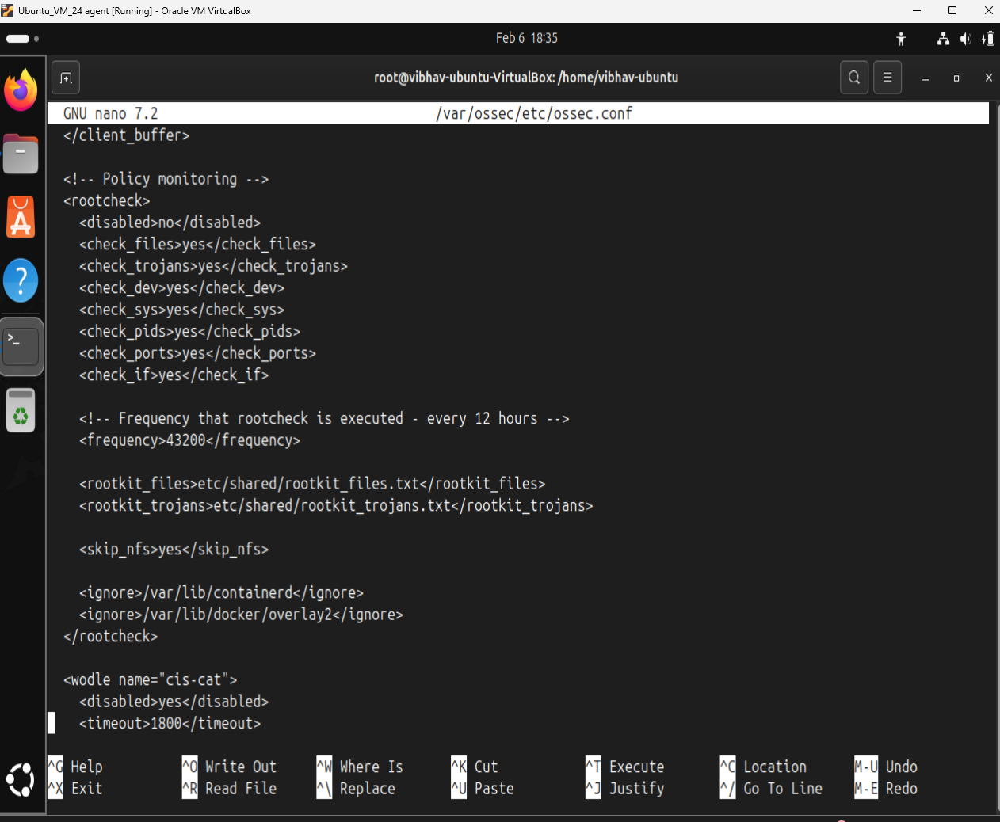

Screenshot description: Trojan wrapper creation used to trigger detection.
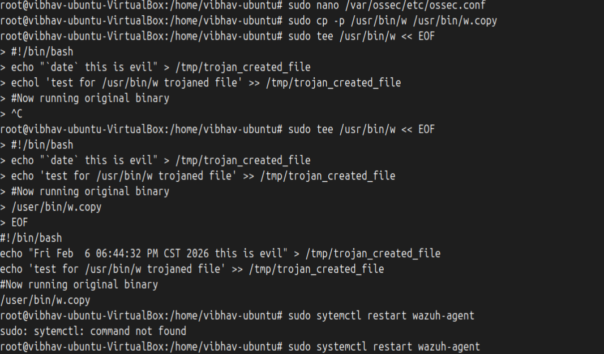

Screenshot description: Dashboard evidence of Rootcheck detection.
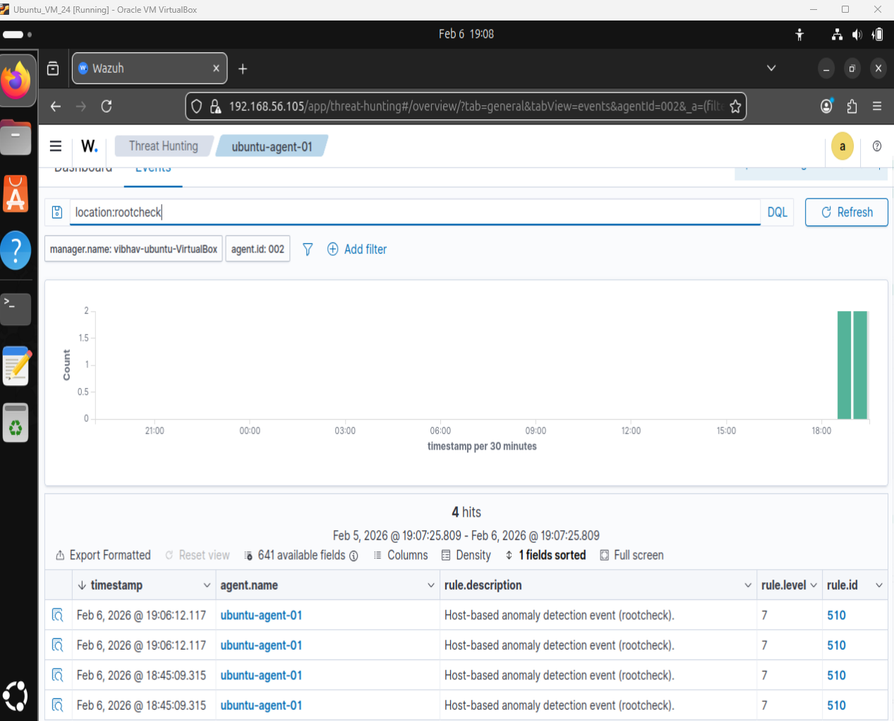

Screenshot description: Supporting logs correlated with Rootcheck activity.
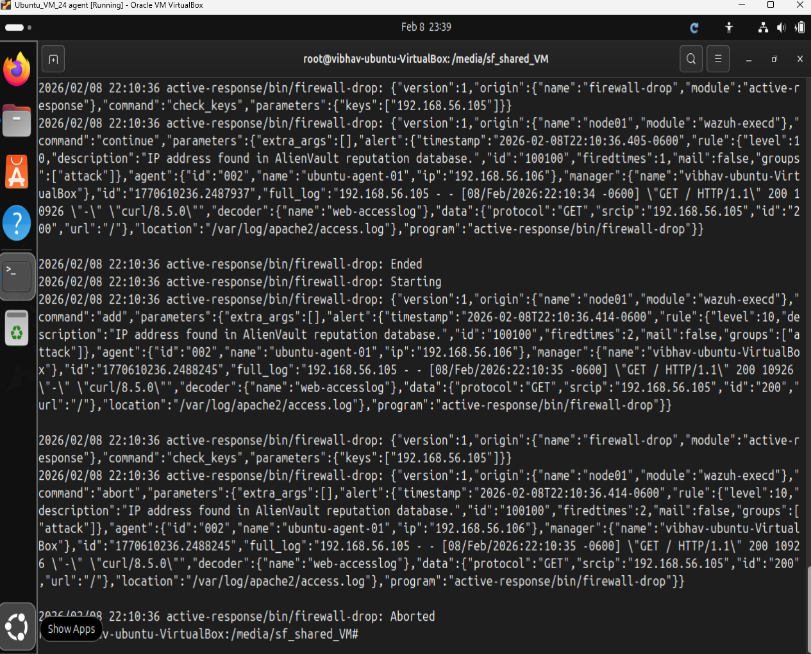

---

## POC 4: IP Reputation Blocking + Active Response (`firewall-drop`)

### Objective
Match traffic source IP against reputation list and trigger active response block.

### Environment / Prerequisites
- Manager running and receiving events
- Agent active
- Service traffic available for simulation (Apache)

**Assumption:** This PoC follows the flow shown in available screenshots (AlienVault list conversion, custom rule `100100`, and `firewall-drop` active response).

### Configuration Steps
#### 1) Download and convert reputation list
```bash
sudo wget https://iplists.firehol.org/files/alienvault_reputation.ipset -O /var/ossec/etc/lists/alienvault_reputation.ipset
sudo wget https://wazuh.com/resources/iplist-to-cdblist.py -O /tmp/iplist-to-cdblist.py
sudo /var/ossec/framework/python/bin/python3 /tmp/iplist-to-cdblist.py \
  /var/ossec/etc/lists/alienvault_reputation.ipset \
  /var/ossec/etc/lists/blacklist-alienvault
sudo chown wazuh:wazuh /var/ossec/etc/lists/blacklist-alienvault
```

**Expected Output**
- Reputation list downloaded and CDB file created

#### 2) Register list in manager config
```xml
<list>etc/lists/blacklist-alienvault</list>
```

**Expected Output**
- Manager config includes blacklist list reference

#### 3) Add custom local rule
```xml
<group name="attack,">
  <rule id="100100" level="10">
    <if_group>web|attack|attacks</if_group>
    <list field="srcip" lookup="address_match_key">etc/lists/blacklist-alienvault</list>
    <description>IP address found in AlienVault reputation database.</description>
  </rule>
</group>
```

**Expected Output**
- Custom rule `100100` loaded

#### 4) Add active response and restart manager
```xml
<active-response>
  <disabled>no</disabled>
  <command>firewall-drop</command>
  <location>local</location>
  <rules_id>100100</rules_id>
  <timeout>60</timeout>
</active-response>
```

```bash
sudo systemctl restart wazuh-manager
```

**Expected Output**
- Manager restarts successfully with active response policy

### Attack Simulation / Test Steps
#### 1) Confirm Apache is running
```bash
sudo systemctl status apache2 --no-pager
```

#### 2) Generate repeated requests
```bash
for i in {1..10}; do
  curl -s -o /dev/null -w "%{http_code}\n" http://192.168.56.106/
  sleep 1
done
```

**Expected Output**
- Requests initially return HTTP codes
- Detection and block behavior appears after matching conditions

### Wazuh Alert Analysis
```text
rule.id:100100
```

**Expected Output**
- Rule `100100`: IP found in reputation database
- Follow-up event: host blocked by `firewall-drop` active response

### Troubleshooting Notes
- Command formatting typo in list download/conversion fixed by rerunning carefully
- No block observed until `<rules_id>` matched rule `100100` and manager was restarted
- Local list update/rebuild was used during debugging

### What this proves for a SOC analyst role
- Ability to operationalize threat-intel matching
- Ability to bind detection to automated containment

Screenshot description: Commands used to download and convert reputation list.
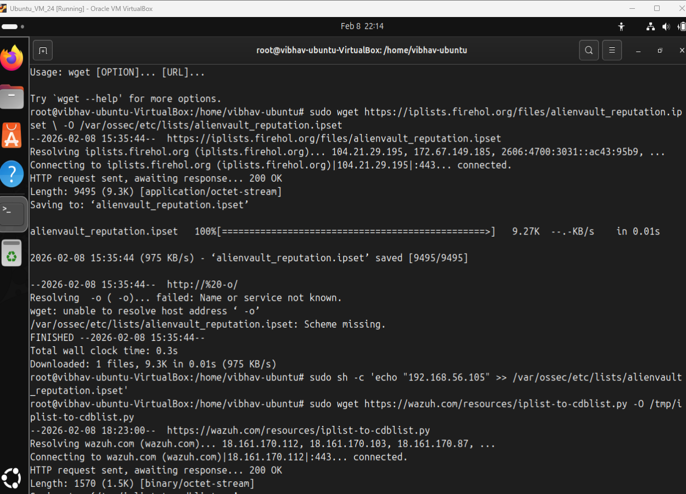

Screenshot description: `ossec.conf` ruleset section with AlienVault list reference.
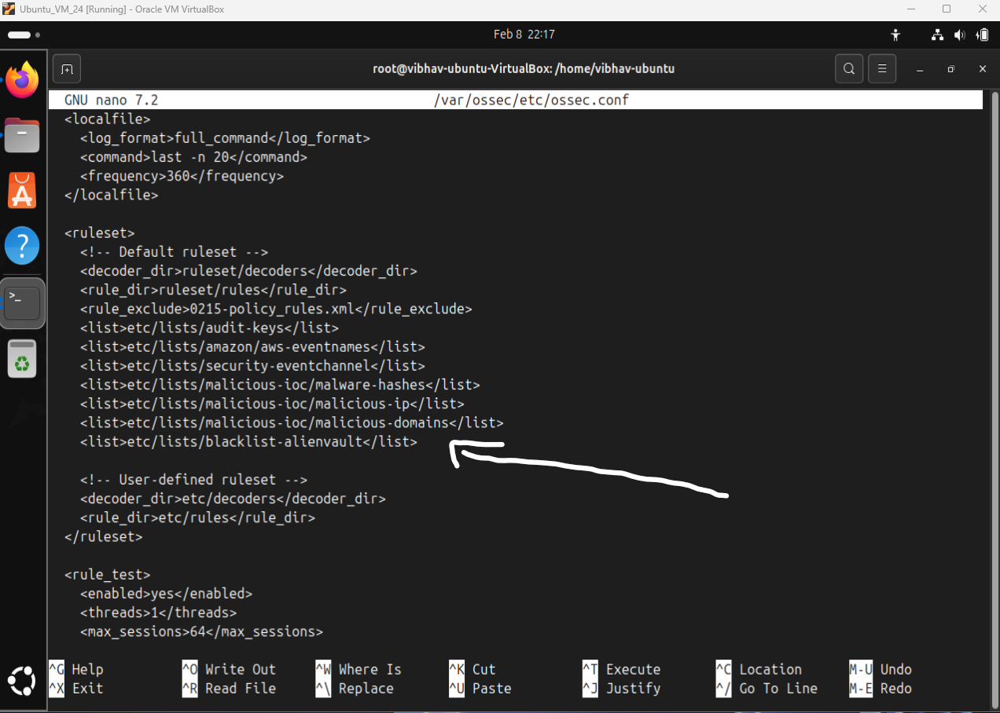

Screenshot description: Custom local rule `100100` for malicious source IP match.
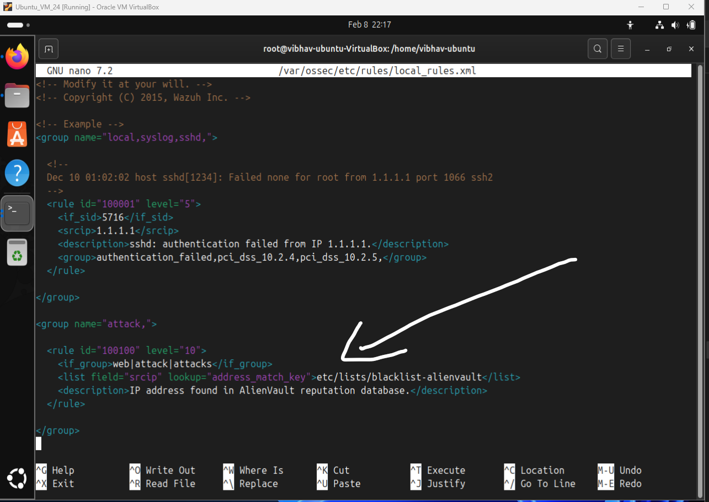

Screenshot description: Active response configuration using `firewall-drop`.
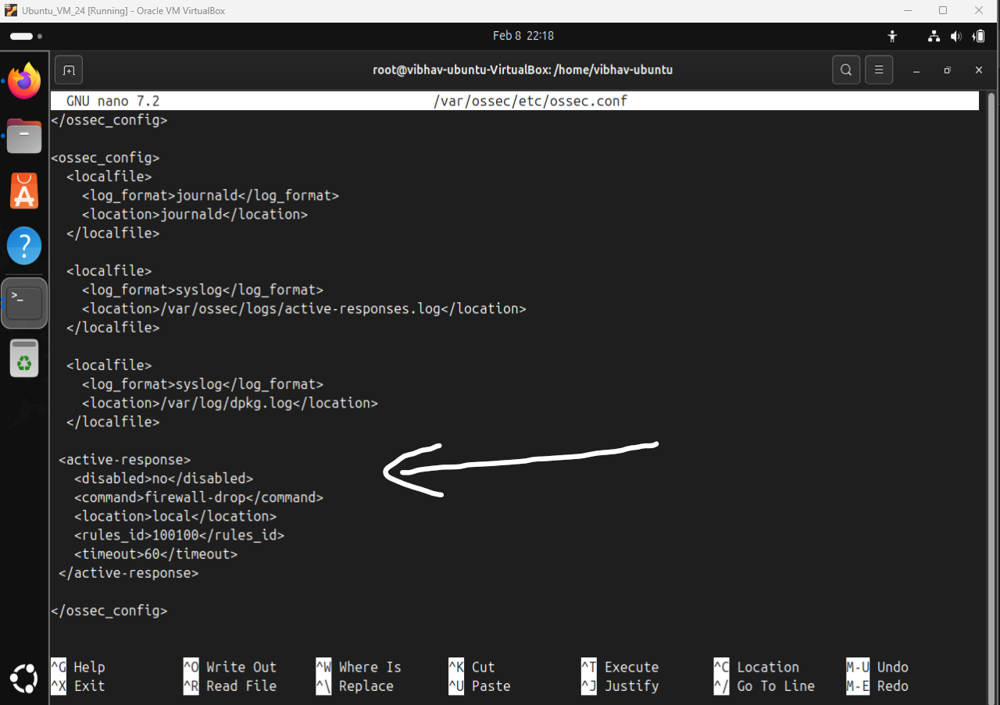

Screenshot description: Apache service status before traffic simulation.
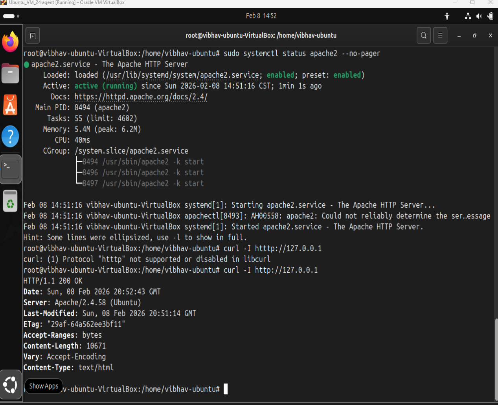

Screenshot description: Repeated traffic generation toward target host.
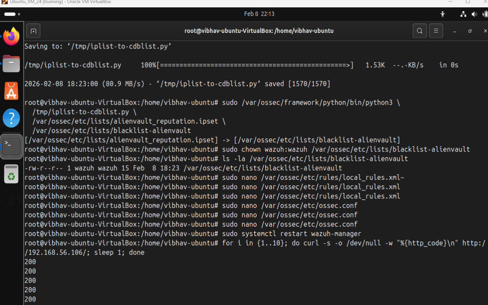

Screenshot description: Threat Hunting output with detection + active response events.
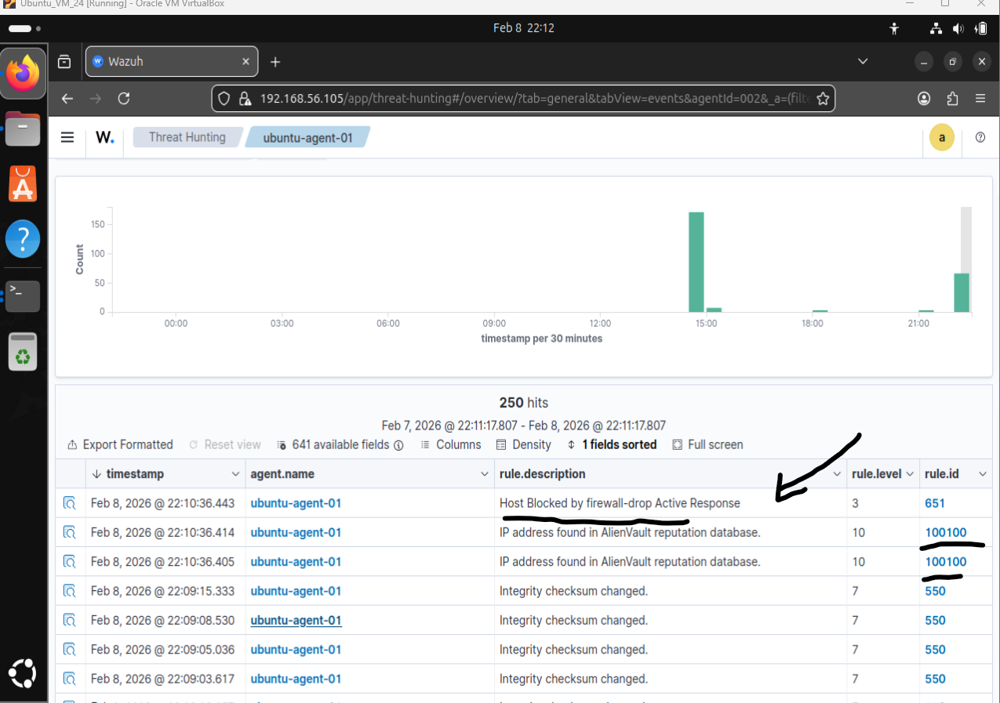

Screenshot description: Evidence of source blocking after rule match.
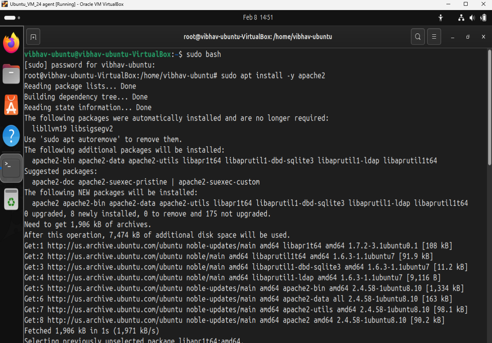

Screenshot description: Local block list adjustment during debugging workflow.


---

## Consolidated Troubleshooting Quick Reference

### 1) Agent not visible in dashboard
```bash
nc -vz 192.168.56.105 1514
nc -vz 192.168.56.105 1515
sudo tail -n 200 /var/ossec/logs/ossec.log
```

### 2) Enrollment fails with invalid agent name
```bash
sudo rm -f /var/ossec/etc/client.keys
sudo /var/ossec/bin/agent-auth -m 192.168.56.105 -p 1515 -A "ubuntu-agent-01"
```

### 3) FIM events missing
- Confirm `report_changes` is correctly set and restart agent.

### 4) Rootcheck PoC breaks command behavior
- Correct wrapper path to `/usr/bin/w.copy` and restore binary after test.

### 5) IP reputation alert without block
- Confirm active response points to correct `<rules_id>` and restart manager.
